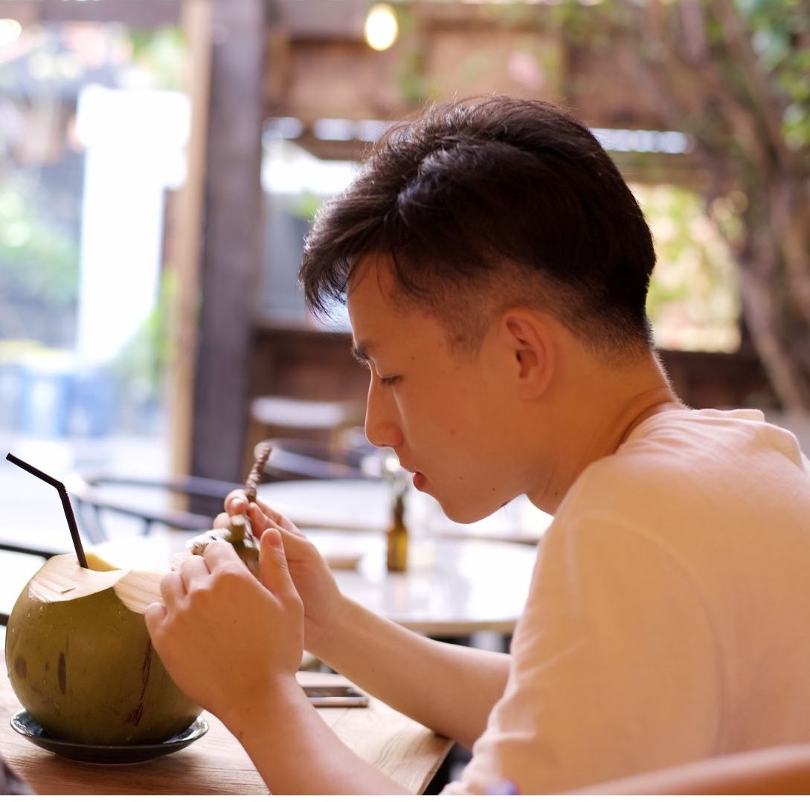

## About Me

I am currently a Ph.D. student at Carnegie Mellon University. I am fortunate to be advised by Prof Kun Zhang and Prof Peter Spirtes. I was fortunate to be advised by [Prof Shuicheng Yan](https://yanshuicheng.ai/), [Prof Hanwang Zhang](https://personal.ntu.edu.sg/hanwangzhang/), [Prof Anh Tuan Luu](https://tuanluu.github.io/), and [Prof Rongrong Ji](https://mac.xmu.edu.cn/rrji_en/). 

## Publications

[ECCV 2020] Xinshuai Dong, Hong Liu, Liujuan Cao, Rongrong Ji, Qixiang Ye, Jianzhuang Liu, and Qi Tian.
API-Net: Robust Generative Classifier via a Single Discriminator.

[ICLR 2021] Xinshuai Dong, Anh Tuan Luu, Rongrong Ji, and Hong Liu. 
Towards Robustness Against Natural Language Word Substitutions.

[NeurIPS 2021] Xinshuai Dong, Anh Tuan Luu, Min Lin, Shuicheng Yan, Hanwang Zhang.
How Should Pre-Trained Language Models Be Fine-Tuned Towards Adversarial Robustness?

[ICML 2022] Haiteng Zhao, Chang Ma, Xinshuai Dong, Anh Tuan Luu, Zhi Hong Deng, Hanwang Zhang.
Certified Robustness Against Natural Language Attacks by Causal Intervention.

[EMNLP 2022] Xiaobao Wu, Anh Tuan Luu, Xinshuai Dong.
Mitigating Data Sparsity for Short Text Topic Modeling by Topic-Semantic Contrastive Learning.

[AAAI 2023] Xiaobao Wu, Xinshuai Dong, Thong Nguyen, Chaoqun Liu, Liang-Ming Pan, Anh Tuan Luu.
InfoCTM: A Mutual Information Maximization Perspective of Cross-lingual Topic Modeling.

[ICML 2023] Xiaobao Wu, Xinshuai Dong, Thong Thanh Nguyen, Anh Tuan Luu.
Effective Neural Topic Modeling with Embedding Clustering Regularization.

[ACL Findings 2023] Thong Thanh Nguyen, Xiaobao Wu, Xinshuai Dong, Cong-Duy T. Nguyen, Zhen Hai, Lidong Bing, Anh Tuan Luu.
Gradient-Boosted Decision Tree for Listwise Context Model in Multimodal Review Helpfulness Prediction.

[EMNLP Findings 2023] Thong Nguyen, Xiaobao Wu, Xinshuai Dong, Cong-Duy Nguyen, See Kiong Ng, Anh Luu. DemaFormer: Damped Exponential Moving Average Transformer with Energy-Based Modeling for Temporal Language Grounding.

[NeurIPS 2023] Ignavier Ng, Yujia Zheng, Xinshuai Dong, Kun Zhang.
On the Identifiability of Sparse ICA without Assuming Non-Gaussianity.

[NeurIPS 2023] Xiangchen Song, Weiran Yao, Yewen Fan, Xinshuai Dong, Guangyi Chen, Juan Carlos Niebles, Eric Xing, Kun Zhang.
Temporally Disentangled Representation Learning under Unknown Nonstationarity.

[ACL Findings 2024] Xiaobao Wu, Xinshuai Dong, Liangming Pan, Thong Nguyen, Anh Tuan Luu. Modeling Dynamic Topics in Chain-Free Fashion by Evolution-Tracking Contrastive Learning and Unassociated Word Exclusion.

[AAAI 2024] Thong Nguyen, Xiaobao Wu, Xinshuai Dong, Khoi Le, Zhiyuan Hu, Cong-Duy Nguyen, See-Kiong Ng, Luu Anh Tuan. READ-PVLA: Recurrent Adapter with Partial Video-Language Alignment for Parameter-Efficient Transfer Learning in Low-Resource Video-Language Modeling.

[ICLR 2024] Songyao Jin, Feng Xie, Guangyi Chen, Biwei Huang, Zhengming Chen, Xinshuai Dong, Kun Zhang. Structural Estimation of Partially Observed Linear Non-Gaussian Acyclic Model: A Practical Approach with Identifiability.

[ICLR 2024] Thong Thanh Nguyen, Xiaobao Wu, Xinshuai Dong, Cong-Duy T Nguyen, See-Kiong Ng, Anh Tuan Luu. Topic modeling as multi-objective optimization with Setwise Contrastive Learning.

[ICLR 2024] Xinshuai Dong, Biwei Huang, Ignavier Ng, Xiangchen Song, Yujia Zheng, Songyao Jin, Roberto Legaspi, Peter Spirtes, Kun Zhang. A Versatile Causal Discovery Framework to Allow Causally-Related Hidden Variables.

[ICML 2024] Ignavier Ng, Xinshuai Dong, Haoyue Dai, Biwei Huang, Peter Spirtes, Kun Zhang. Score-Based Causal Discovery of Latent Variable Causal Models.

[ECCV 2024] Thong Nguyen, Yi Bin, Xiaobao Wu, Xinshuai Dong, Zhiyuan Hu, Khoi Le, Cong-Duy Nguyen, See Kiong Ng, Luu Anh Tuan. Meta-optimized Angular Margin Contrastive Framework for Video-Language Representation Learning.

[NeurIPS 2024] Xinshuai Dong, Ignavier Ng, Biwei Huang, Yuewen Sun, Songyao Jin, Roberto Legaspi, Peter Spirtes, Kun Zhang. On the Parameter Identifiability of Partially Observed Linear Causal Models.

[NeurIPS 2024] Xiangchen Song, Zijian Li, Guangyi Chen, Yewen Zheng, Yujia, Fan, Xinshuai Dong, Kun Zhang. Causal Temporal Representation Learning with Nonstationary Sparse Transition.

[NeurIPS 2024] Yuewen Sun, Biwei Huang, Yu Yao, Donghuo Zeng, Xinshuai Dong, Songyao Jin, Boyang Sun, Roberto Legaspi, Kazushi Ikeda, Peter Spirtes, Kun Zhang. Identifying Latent State Transition Processes for Individualized Reinforcement Learning.

[ICLR 2025] Haoyue Dai, Ignavier Ng, Jianle Sun, Zeyu Tang, Gongxu Luo, Xinshuai Dong, Peter Spirtes, Kun Zhang. When Selection meets Intervention: Additional Complexities in Causal Discovery.

[ICLR 2025] Zijian Li, Shunxing Fan, Yujia Zheng, Ignavier Ng, Shaoan Xie, Guangyi Chen, Xinshuai Dong, Ruichu Cai, Kun Zhang. Synergy Between Sufficient Changes and Sparse Mixing Procedure for Disentangled Representation Learning.

[AISTATS 2025] Jiaqi Sun, Yujia Zheng, Xinshuai Dong, Haoyue Dai, Kun Zhang. Type Information-Assisted Self-Supervised Knowledge Graph Denoising.

[AISTATS 2025] Ignavier Ng, Shaoan Xie, Xinshuai Dong, Peter Spirtes, Kun Zhang. Causal Representation Learning from General Environments under Nonparametric Mixing.

## Educations

Carnegie Mellon University

Nanyang Technological University

Xiamen University

## Experiences

Central Media Technology Institute, HUAWEI TECHNOLOGIES CO. LTD

Sea AI Lab, SEA LTD

## Services

ICML 2022-2025 Reviewer
NeurIPS 2021-2024 Reviewer
ICLR 2022-2025 Reviewer

## Contact
Email: dongxinshuai[AT]outlook[DOT]com, xinshuai001[AT]e[DOT]ntu[DOT]edu[DOT]sg, xinshuad[AT]andrew[DOT]cmu[DOT]edu

---

